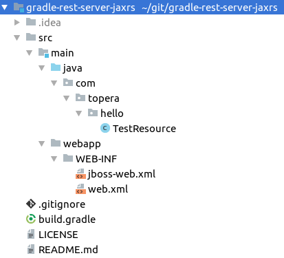

# Topera's Hello World #003
## Rest Server with Gradle (using JAX-RS)
This hello world is a Rest Server created with Gradle and Jersey

## How to download this source code
* Install [Gradle](https://gradle.org/install)
* Use the `Clone or download` button above the get the url of this repository
* In IntelliJ IDEA: File → New → Project From Version Control → Git → put the url of this repository

## How to test
* $ cd gradle-rest-server-jaxrs
* $ gradle war
* Get generated war from ./build/libs and deploy it.
* This example is configured to have a context root in "/", in JBoss. So, to test, please access: http://localhost:8080/api/test
* In other servers, access: http://localhost:8080/gradle-rest-server-jaxrs-1.0/api/test

## Tech Stack
* Intellij IDEA 2016.1.4
* Gradle 3.5.1
* Java 8

## Folder Structure

To take a look in other projects, please see https://github.com/topera/index

